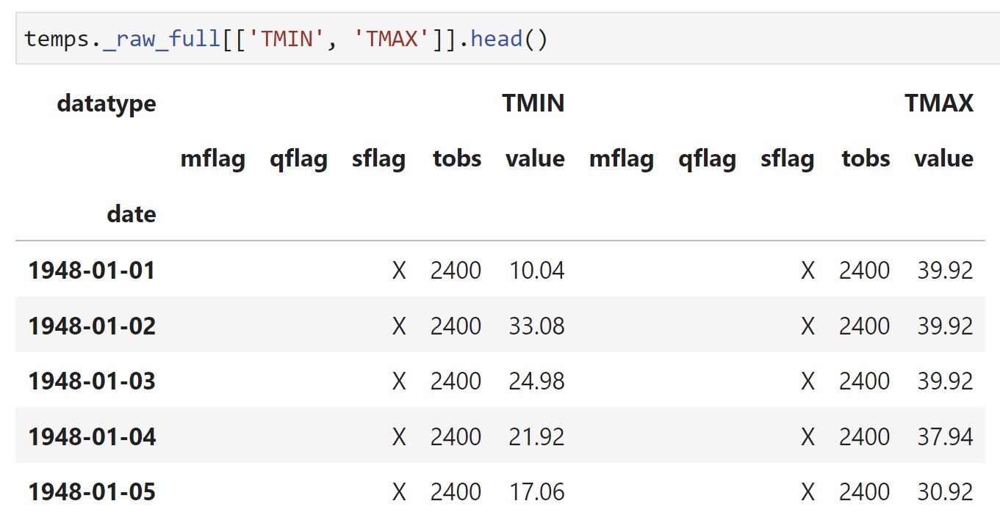
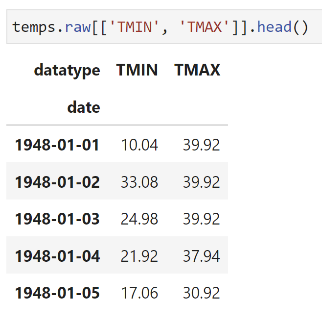
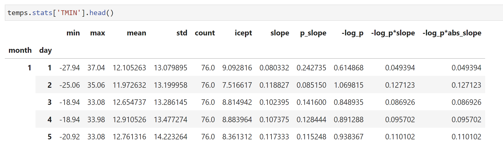

# pyGHCND

*pyGHCND* is a Python library for collecting and plotting weather data from
NOAA's National Centers for Environmental Information (NCEI) [Global
Historical Climatology Network daily
(GHCNd)](https://www.ncei.noaa.gov/products/land-based-station/global-historical-climatology-network-daily)
datasets.  These data are accessed using [NCEI's Climate Data Online (CDO)
API](https://www.ncdc.noaa.gov/cdo-web/webservices/v2) and filtered based on the
corresponding [attribute
flags](https://www.ncei.noaa.gov/data/global-historical-climatology-network-daily/doc/GHCND_documentation.pdf).
Some statistical analyses on the data trends are then performed. These raw and
statistical data tables (Pandas DataFrames) are saved to disk. Several
plotting functions are provided to facilitate plotting trends in these data
over time.

## Requirements

* python >= 3.10
* requests >= 2.20
* pandas >= 1.5
* pyarrow >= 8.0
* scipy >= 1.10
* matplotlib >= 3.7
* openpyxl >= 3.0
* tqdm >= 4.60

## Simple Usage Example

The following code block is a complete example of the data collection,
analysis, and plotting using *pyGHCND*. With one exception, this code be saved
into a .py file and executed from the command line, for example. An API token
needs to be obtained from the CDO API website and saved into a file called
'token.txt'. A description of each line of code is found in the sections
below.

    from pyghcnd import GHCND

    with open('token.txt') as token_file:
        token = token_file.read().strip()
        temps = GHCND('USW00024153', token, data_folder='MissoulaMSO')
    temps.update_data(status=True)

    temps.stats.to_excel('MSO_stats.xlsx')

## Basic Data Collection

The core element of *pyGHCND* is a simple object class called `GHCND`.

    from pyghcnd import GHCND

To create a GHCND object instance, two pieces of data are necessary: an API
token and a GHCNd station ID. The API token is freely available from the
[Climate Data Online website](https://www.ncdc.noaa.gov/cdo-web/token). The
desired station ID can be found using the [CDO mapping
tool](https://www.ncei.noaa.gov/maps/daily-summaries/), for example. The full
station ID will be something like "GHCND:USW00024153", which corresponds to
the Missoula, Montana, airport. The station ID without the preceding "GHCND:"
-- e.g. "USW00024153" -- is also acceptable. 

The GHCND class has the following initialization call signature.

    GHCND(stationid, token, store_type='parquet', data_folder='.')

The `stationid` and `token` are the strings representing the station ID and
API token as described above. The `store_type` keyword argument determines the
storage format for the raw and statistical data. The default (`'parquet'`)
uses [Parquet binary files](https://parquet.apache.org/), which were developed
specifically for column-oriented data (e.g. DataFrames). The `data_folder`
keyword argument setts the folder where data and plots will be stored. The
default is the current directory (`'.'`). Note: the stored data
files and plots have a fixed naming scheme, so downloading multiple datasets
into the same folder will overwrite previous data sets.

In the following example, a `GHCND` object instance for the historical weather
data at the [Missoula International
Airport](https://www.ncdc.noaa.gov/cdo-web/datasets/GHCND/stations/GHCND:USW00024153/detail)
will be created. This is assuming that the API token has been saved into a
text file called 'token.txt' in the current directory (i.e. *not* the
`data_folder` directory). Note: this code will make an API call, so an
external internet connection is necessary.

    with open('token.txt') as token_file:
        token = token_file.read().strip()
        temps = GHCND('USW00024153', token, data_folder='MissoulaMSO')

On initialization, the GHCND object performs several operations. First, an API
call is made to collect station metadata, such as the start and end dates for
the data at that location -- these are saved as the `start_date` and
`end_date` attributes, respectively. (The raw metadata is stored as the
private `_station_info` dictionary.) It then checks for the existence of the
given data folder. If it is not found, the folder is created. However, if the
folder is present, a check is performed to determine if previously
downloaded/processed data is present, and if so, these data are loaded into
the object instance (more info below). This makes it possible to manipulate
previously downloaded data or append newly downloaded information without
having to re-download the entire dataset.

The `update_data` method is used to download new data using the CDO API. This
method accepts only a single Boolean keyword argument: `status`. The default
for this argument is `False`, which means that the data will be downloaded
silently. If this argument is `True`, then a download status bar will be
printed to the screen, using the [`tqdm`
package](https://github.com/tqdm/tqdm). The example below will download the
data with a progress bar.

    temps.update_data(status=True)

The download process can be slow. The CDO API restrict a single data request
to a total of 1000 data points, and only 5 requests can be made per second.
Each year may consist of several thousand data points, so if data is being
collected for long time intervals, the total number of requests will be
substantial. For example, the Missoula airport has daily weather data from
1948 to the present.  To protect against broken connections, a temporary file
(pickle format) of raw download data is periodically saved in the data folder
during the download process, and in the event that the download is restarted, the
temporary file will first be loaded as a starting point.

## The Data Attributes

After completion of the data download, one private DataFrame attribute --
`_raw_full` -- will be created and saved to disk. A selection of this
DataFrame as rendered in a Jupyter notebook is shown below. This DataFrame is
stored as a "hidden" attribute because it is probably not necessary/desired to
work with this directly; however, it is instructive to view it to help
understand what the unprocessed raw data looks like and how it is filtered, as
described below. The API data is initially delivered in JSON format, and after
complete download, these data are reformatted into a Pandas DataFrame indexed
by the collection date.  The columns of this DataFrame are the data types,
such as max temp (TMAX), min temp (TMIN), etc.  Under these data type columns,
there are several sub-columns for the recorded value ("value") and the
measurement attributes, such as the data quality ("qflag"). The data types and
attributes are described in the GHCNd documentation. This DataFrame is saved
to disk using the `store_type` selected above.

This full data set is then filtered to remove measurements flagged as being
problematic -- this filtered DataFrame is called `raw`. An example of this
DataFrame, as rendered in a Jupyter notebook, is shown below. Bad measurements
in the `_raw_full` DataFrame, as determined by their quality attribute
("qflag"), are replaced with `NaN` in the `raw` table. The `raw` DataFrame
retains the date index, but simplifies the columns to be only the measured
values for each data type. Two new columns are also created. The first is a
'yeardiff' column, which is only used for linear regression analysis as
detailed below. The second column, called `SNPR`, is calculated by the
equation (PRCP + SNOW/10) and is the rough estimate of the total water on a
particular day assuming that 1" of snow equals 0.1" of liquid precipitation.
The `raw` attribute is not saved to disk. If previously downloaded data is
reloaded in a new `GHCND` instance, the `raw` DataFrame is instead recreated
from the saved `_raw_full` DataFrame.

A variety of statistical analyses are then conducted on the filtered `raw`
data and saved into a `stats` DataFrame attribute. An example of this
DataFrame, as rendered in a Jupyter notebook, is shown below. Several of these
analyses are self-evident: lowest value=='min', highest value=='max',
average='mean', standard deviation='std'. However, the maximum and minimum
daily temperatures (TMAX and TMIN, respectively) are also subjected to a
linear regression analysis. In other words, the trend in the highest and
lowest temperatures for any given day in the year. The slope and intercept of
these trends are the 'slope' and 'icept' columns, respectively. The 'p_slope'
column is the p-value for the calculated slope. The two columns
'-log_p\*slope' are the slopes weighted by the negative base-10 logarithm of
the p value. These values are convenient for ranking these slope values, as
will be described in the plotting section. This DataFrame is also saved to
disk using the `store_type` selected above.

As all three of these data attributes are DataFrames, all of the DataFrame
methods are available here as well. For example, the statistics data can be
saved as an Excel file using the `to_excel` method.

    temps.stats.to_excel('MSO_stats.xlsx')

