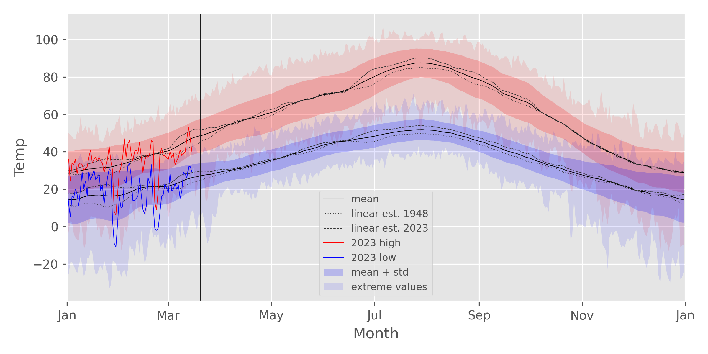

# pyGHCND

*pyGHCND* is a Python library for collecting and plotting weather data from
NOAA's National Centers for Environmental Information (NCEI) [Global
Historical Climatology Network daily
(GHCNd)](https://www.ncei.noaa.gov/products/land-based-station/global-historical-climatology-network-daily)
datasets.  These data are accessed using [NCEI's Climate Data Online (CDO)
API](https://www.ncdc.noaa.gov/cdo-web/webservices/v2) and filtered based on the
corresponding [attribute
flags](https://www.ncei.noaa.gov/data/global-historical-climatology-network-daily/doc/GHCND_documentation.pdf).
Some statistical analyses on the data trends are then performed. These raw and
statistical data tables (Pandas DataFrames) are saved to disk. Several
plotting functions are provided to facilitate plotting trends in these data
over time.

## Requirements

* python >= 3.10
* requests >= 2.20
* pandas >= 1.5
* pyarrow >= 8.0
* scipy >= 1.10
* matplotlib >= 3.7
* openpyxl >= 3.0
* tqdm >= 4.60

## Simple Usage Example

The following code block is a complete example of the data collection,
analysis, and plotting using *pyGHCND*. With one exception, this code be saved
into a .py file and executed from the command line, for example. An API token
needs to be obtained from the CDO API website and saved into a file called
'token.txt'. A description of each line of code is found in the sections
below.

    from pyghcnd import GHCND, mplvis
    import matplotlib.pyplot as plt
    plt.style.use('ggplot')

    with open('token.txt') as token_file:
        token = token_file.read().strip()
        temps = GHCND('USW00024153', token, data_folder='MissoulaMSO')
    temps.update_data(status=True)

    temps.stats.to_excel('MSO_stats.xlsx')
    
    mplvis.plot_temp(temps)
    mplvis.plot_temp_diffs(temps)
    mplvis.plot_prcp(temps, ptype='SNPR')
    mplvis.plot_daily_temp(temps, day=1, month=1)

## Basic Data Collection

The core element of *pyGHCND* is a simple object class called `GHCND`.

    from pyghcnd import GHCND

To create a GHCND object instance, two pieces of data are necessary: an API
token and a GHCNd station ID. The API token is freely available from the
[Climate Data Online website](https://www.ncdc.noaa.gov/cdo-web/token). The
desired station ID can be found using the [CDO mapping
tool](https://www.ncei.noaa.gov/maps/daily-summaries/), for example. The full
station ID will be something like "GHCND:USW00024153", which corresponds to
the Missoula, Montana, airport. The station ID without the preceding "GHCND:"
-- e.g. "USW00024153" -- is also acceptable. 

The GHCND class has the following initialization call signature.

    GHCND(stationid, token, store_type='parquet', data_folder='.')

The `stationid` and `token` are the strings representing the station ID and
API token as described above. The `store_type` keyword argument determines the
storage format for the raw and statistical data. The default (`'parquet'`)
uses [Parquet binary files](https://parquet.apache.org/), which were developed
specifically for column-oriented data (e.g. DataFrames). The `data_folder`
keyword argument setts the folder where data and plots will be stored. The
default is the current directory (`'.'`). Note: the stored data
files and plots have a fixed naming scheme, so downloading multiple datasets
into the same folder will overwrite previous data sets.

In the following example, a `GHCND` object instance for the historical weather
data at the [Missoula International
Airport](https://www.ncdc.noaa.gov/cdo-web/datasets/GHCND/stations/GHCND:USW00024153/detail)
will be created. This is assuming that the API token has been saved into a
text file called 'token.txt' in the current directory (i.e. *not* the
`data_folder` directory). Note: this code will make an API call, so an
external internet connection is necessary.

    with open('token.txt') as token_file:
        token = token_file.read().strip()
        temps = GHCND('USW00024153', token, data_folder='MissoulaMSO')

On initialization, the GHCND object performs several operations. First, an API
call is made to collect station metadata, such as the start and end dates for
the data at that location -- these are saved as the `start_date` and
`end_date` attributes, respectively. (The raw metadata is stored as the
private `_station_info` dictionary.) It then checks for the existence of the
given data folder. If it is not found, the folder is created. However, if the
folder is present, a check is performed to determine if previously
downloaded/processed data is present, and if so, these data are loaded into
the object instance (more info below). This makes it possible to manipulate
previously downloaded data or append newly downloaded information without
having to re-download the entire dataset.

The `update_data` method is used to download new data using the CDO API. This
method accepts only a single Boolean keyword argument: `status`. The default
for this argument is `False`, which means that the data will be downloaded
silently. If this argument is `True`, then a download status bar will be
printed to the screen, using the [`tqdm`
package](https://github.com/tqdm/tqdm). The example below will download the
data with a progress bar.

    temps.update_data(status=True)

The download process can be slow. The CDO API restrict a single data request
to a total of 1000 data points, and only 5 requests can be made per second.
Each year may consist of several thousand data points, so if data is being
collected for long time intervals, the total number of requests will be
substantial. For example, the Missoula airport has daily weather data from
1948 to the present.  To protect against broken connections, a temporary file
(pickle format) of raw download data is periodically saved in the data folder
during the download process, and in the event that the download is restarted, the
temporary file will first be loaded as a starting point.

## The Data Attributes

After completion of the data download, one private DataFrame attribute --
`_raw_full` -- will be created and saved to disk. A selection of this
DataFrame as rendered in a Jupyter notebook is shown below. This DataFrame is
stored as a "hidden" attribute because it is probably not necessary/desired to
work with this directly; however, it is instructive to view it to help
understand what the unprocessed raw data looks like and how it is filtered, as
described below. The API data is initially delivered in JSON format, and after
complete download, these data are reformatted into a Pandas DataFrame indexed
by the collection date.  The columns of this DataFrame are the data types,
such as max temp (TMAX), min temp (TMIN), etc.  Under these data type columns,
there are several sub-columns for the recorded value ("value") and the
measurement attributes, such as the data quality ("qflag"). The data types and
attributes are described in the GHCNd documentation. This DataFrame is saved
to disk using the `store_type` selected above.

This full data set is then filtered to remove measurements flagged as being
problematic -- this filtered DataFrame is called `raw`. An example of this
DataFrame, as rendered in a Jupyter notebook, is shown below. Bad measurements
in the `_raw_full` DataFrame, as determined by their quality attribute
("qflag"), are replaced with `NaN` in the `raw` table. The `raw` DataFrame
retains the date index, but simplifies the columns to be only the measured
values for each data type. Two new columns are also created. The first is a
'yeardiff' column, which is only used for linear regression analysis as
detailed below. The second column, called `SNPR`, is calculated by the
equation (PRCP + SNOW/10) and is the rough estimate of the total water on a
particular day assuming that 1" of snow equals 0.1" of liquid precipitation.
The `raw` attribute is not saved to disk. If previously downloaded data is
reloaded in a new `GHCND` instance, the `raw` DataFrame is instead recreated
from the saved `_raw_full` DataFrame.

A variety of statistical analyses are then conducted on the filtered `raw`
data and saved into a `stats` DataFrame attribute. An example of this
DataFrame, as rendered in a Jupyter notebook, is shown below. Several of these
analyses are self-evident: lowest value=='min', highest value=='max',
average='mean', standard deviation='std'. However, the maximum and minimum
daily temperatures (TMAX and TMIN, respectively) are also subjected to a
linear regression analysis. In other words, the trend in the highest and
lowest temperatures for any given day in the year. The slope and intercept of
these trends are the 'slope' and 'icept' columns, respectively. The 'p\_slope'
column is the p-value for the calculated slope. The two columns
'-log\_p\*slope' are the slopes weighted by the negative base-10 logarithm of
the p value. These values are convenient for ranking these slope values, as
will be described in the plotting section. This DataFrame is also saved to
disk using the `store_type` selected above.

As all three of the data attributes are DataFrames, all of the methods for
this object class are available here as well. For example, the statistics data
can be saved as an Excel file using the `to_excel` method.

    temps.stats.to_excel('MSO_stats.xlsx')

## Plotting Functions

Several plotting functions are also provided for visualizing the raw and
statistical weather data. Currently, these functions are only available for
Matplotlib and are found in the `mplvis` module, which can be imported
directly from `pyghcnd`.

    from pyghcnd import GHCND, mplvis

### Yearly Temperature Plot

The `plot_temp` function is used to plot the statistical data for the year as
well as the high/low temps for a given year. The call signature for this
function is shown below.

    mplvis.plot_temp(ghcnd, use_year=None, trends=True, smooth=15, 
                show=True, save=True, dpi=300)

The required `ghcnd` positional argument must be a `GHCND` object instance.
The `use_year` keyword argument is used to select a year for plotting the
high/low temps as an overlay on the statistical values. Its default of `None`
causes it to select the current year. The `trends` Boolean keyword argument
plots additional lines representing the high/low temperatures as extrapolated
from the linear regression equation fitted to the daily temperature values.
This can help to visualize the estimated increase/decrease in the average
temperature over time. The `smooth` keyword argument is used to apply a simple
moving average smoothing function to some of the plotted data, which can
improve the appearance of the plots. The value can either be a positive
integer (default: 15) that represents the number of points to use in the
smoothing average, or this parameter can be `None`/`False`, which plots the
unsmoothed data. The `show` and `save` Boolean keyword arguments turn on/off
the showing of the plot in a GUI window/notebook cell and saving of the plot
to disk, respectively. The `dpi` keyword argument is a positive integer that
sets the DPI for the saved figure.

An example of a `plot_temp` plot for the Missoula Airport (as of mid-March
2023) is shown below. The solid red and blue lines are the 2023 high and low
temps, respectively, and the solid black line is the average daily
temperature. The thin black vertical line indicates the current date.  The
light blue/red shaded area shows the total range between the largest and
smallest of measured temperatures for that particular day. The slightly darker
shaded region shows the range defined by the average temp +/- one standard
deviation. I.e. 68% of the measured values fall in that range.  The dotted and
dashed lines are the average temperatures estimated from the linear regression
analysis of the daily temperatures. For example, in the plot shown, both the
low and high daily temperatures increase considerably from 1948 (dotted line)
to the present (dashed line) during January, March, and the summer/early fall
months. (But from this plot, it is not possible to infer statistical
significance from these changes.) 

### Recent Temperature Deviations

The `plot_temp_diffs` function is used to plot the deviations of the recent
high/low temperatures from the average values over the same time frame. The
call signature of this function is shown below.

    mplvis.plot_temp_diffs(ghcnd, ndays=90, show=True, save=True, dpi=300)

Again, the only required positional argument, `ghcnd`, is a `GHCND` object
instance containing the data to be plotted. The `ndays` keyword argument is a
positive integer that determines the number of days to use in the plot. The
default (`90`) means that the deviations for the final 90 days of data will be
plotted. The keyword arguments `show`, `save`, and `dpi` are equivalent to the
usage for the [Yearly Temperature Plot function](#yearly-temperature-plot).

An example of a `plot_temp_diffs` figure for the Missoula Airport (as of
mid-March 2023) is shown below. The color coding and plotting elements are
equivalent the [Yearly Temperature Plot function](#yearly-temperature-plot).
In this case, the data oscillate around 0 on the y-axis, because that
represents the average temperature for that particular day. If the solid lines
are greater than 0, then the daily high/low temperature was warmer than
average, and vice versa for points below the center of the y-axis. In the
example plot, the temperatures for most days appear to be about average;
however, there are a few particularly cold streaks, with the cold snap in late
February being records lows for the daily high temperatures. 

### Precipitation Plot

The `plot_prcp` function is used to plot various precipitation data, such as
the cumulative precipitation for the year, daily precipitation values, and a
distribution of yearly total precipitation. The call signature for this
function is as shown below.

    mplvis.plot_prcp(ghcnd, use_year=None, ptype='PRCP', n_missing=10, 
                show=True, save=True, dpi=300)

The required argument, `ghcnd`, is again a `GHCND` object instance with the
required data. The `use_year` keyword argument a positive integer used to set
the main display year. If this argument is left with its default value of
`None`, the current year will be used. The `ptype` keyword argument is a
string used to select the type of data to plot. The acceptable values are
`'PRCP'` (precipitation, default), `'SNOW'` (snow), `'SNPR'` (sum of
precipitation and snow/10). The `n_missing` keyword is a positive integer that
is used to filter out yearly data for which the number of missing data are
equal to or greater than this value. The keyword arguments `show`, `save`, and
`dpi` are equivalent to the usage for the [Yearly Temperature Plot
function](#yearly-temperature-plot).

An example of a `plot_prcp` figure (using the keyword argument `ptype='SNPR'`)
for the Missoula airport (as of mid-March 2023) is shown below. The figure
consists of three subplots. The upper left plot show the cumulative
precipitation (in inches) for the year. The solid black line is the average
cumulative precipitation for the year based on all the data, and the solid red
line is the cumulative data for the year defined by the `use_year` keyword
argument. The thin, semi-transparent blue lines are cumulative precipitation
for every year for which enough data is present (i.e.  having more than
365-`n_missing` days of measurements data). The lower left bar plot shows
daily precipitation values. Black bars are the average daily precipitation,
and red bars are the measured precipitation for the year determined by the
`use_year` keyword argument. The darker blue bars are the average daily
precipitation plus one standard deviation, and the lightest blue bars are the
maximum precipitation for a given day. The histogram on the right shows a
distribution of total precipitation for all the years of station data. The
solid vertical black line shows the average total precipitation for the year,
and the solid red vertical line is the total precipitation for the year
defined by the `use_year` keyword argument.

### Daily Temperature Trends

The `plot_daily_temp` function is used to plot high and low temperature trends
for a particular day of the year. The call signature for this function is
shown below.

    mplvis.plot_daily_temp(ghcnd, month, day, temp_type='both', p=0.05, 
                  show=True, save=True, dpi=300):

In addition to the `GHCND` instance positional argument `ghcnd`, there are two
other required positional arguments: `month` and `day`. These need to be
positive integers that correspond to the month (1-12) and day (1-31) of the
year for which to plot the trends. The `temp_type` keyword argument is a
string used to select the type of data to plot to create. The default `'both'`
creates a plot for both the high and low daily temps. This can also be
`'TMIN'` or `'TMAX'`, if a plot of only the low or high temperature data,
respectively, is desired. The `p` keyword argument is a floating point number
that corresponds to the p-value cutoff for determining statistical
significance. This affect the plotting properties as described below. The
default is `0.05`, which corresponds to a 95% confidence level. The keyword
arguments `show`, `save`, and `dpi` are equivalent to the usage for the
[Yearly Temperature Plot function](#yearly-temperature-plot).

An example of the `plot_daily_temp` figure for both the high and low
temperatures on January 1st at the Missoula airport (as of mid-March 2023) is
shown below. The blue and red lines in the upper plots are the measured low
and high temperatures for every year in the stations records. The black line
is the fitted linear regression line for these data. This line will either be
a solid or dashed line, depending on the p-value of the regression slope. If
the p-value is greater than the `p` keyword argument value, then the slope is
not significant, and the trend line will be dashed. Alternatively,
statistically significant slopes will be plotted as solid lines. For the
example plot, it appears that these temperatures do not show a statistically
significant change over the lifetime of the station data. A method for
plotting the most significant trends will be discussed below. The lower plots
show the residuals, or trend minus actual temperatures, for the low and high
temperature values. Ideally, the residuals should be randomly distributed
about zero.  

